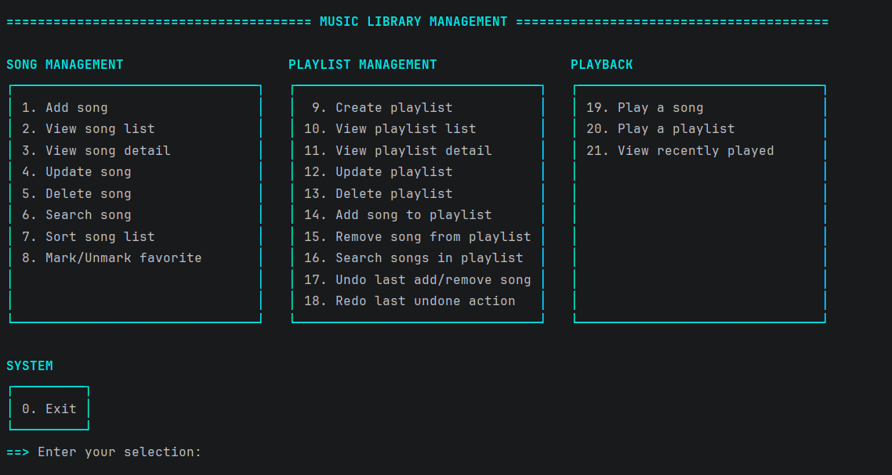
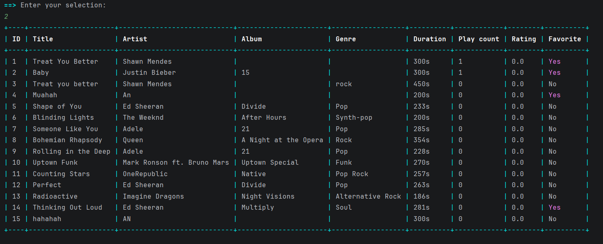
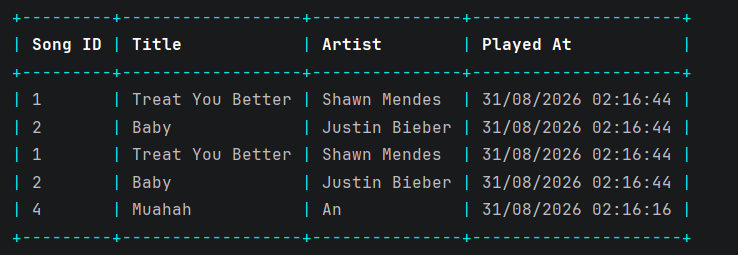

# Music Library Management System

A Spotify-like Music Library Management System built as a terminal application in Java. All data is stored in files — no database is used.

## Project Overview

* Developer: Ho Le Thien An
* Development period: August 11, 2026 – August 30, 2026
* Platform: Terminal (command-line interface)
* Language: Java (JDK 8)

## Architecture

The project follows the Model–View–Controller (MVC) pattern, split into 7 packages:

```
src/
├── model/        Song, Playlist, HistoryEntry
├── view/         Console UI (menu, tables, ANSI colors)
├── controller/   Business logic coordinating view and data
├── data/         File-based repositories (read/write persistence)
├── util/         Shared utilities (Inputter, Validator, FileHandler, ...)
├── structures/   Custom data structures
└── algorithms/   Custom algorithms
database/         Data files (songs.txt, playlists.txt, history.txt)
```

## Data Structures & Algorithms

All implemented from scratch (no built-in Java collections/utilities used for these):

- `structures/CircularDoublyLinkedList.java` — a circular doubly linked list that stores the ordered song IDs inside a playlist
- `structures/Stack.java` — a stack that backs the Undo/Redo feature
- `algorithms/LinearSearch.java` — linear search, used for searching songs and searching inside a playlist
- `algorithms/MergeSort.java` — merge sort, used for sorting the song list
- `algorithms/Shuffle.java` — a Fisher–Yates style shuffle, used to randomize playback order

## Features

### Basic (B)
- Song CRUD (add, view list, view detail, update, delete)
- Playlist CRUD (create, view list, view detail, update, delete)
- Search songs by title, artist, or genre
- Sort songs by title, artist, or duration
- Add or remove songs from playlists
- Mark or unmark favorite songs
- View playlist details

### Medium (M)
- Recently played history
- Shuffle playlist playback
- Repeat playback mode (repeat all / repeat one song)
- Search within playlists

### Hard (H)
- Undo/Redo for adding/removing songs in a playlist, backed by a custom Stack implementation

### Creativity
- Colored console UI using ANSI escape codes
- Main menu grouped into equal-width boxes (Song / Playlist / Playback) instead of a plain numbered list

## Creativity: ANSI Color Meaning

Each color in the console UI is used consistently for one specific meaning, defined in `view/AnsiColors.java`:

| Color | Code | Meaning |
|---|---|---|
| Bright cyan | `96` | Box borders / frame lines of the menu |
| Bold cyan | `1;96` | Section titles (e.g. "SONG MANAGEMENT"), the main title bar, and the `==>` input prompt |
| Bold white | `1;97` | Table column headers |
| Bright green | `92` | Success messages (e.g. confirmation after an action, "Goodbye!" on exit) |
| Bright red | `91` | Error messages (e.g. song/playlist not found, invalid input) |
| Bright yellow | `93` | Warnings (e.g. "Nothing to undo/redo") |
| Bright magenta | `95` | Highlights a song marked as Favorite ("Yes") |
| Dim/faded | `2` | Marks data that no longer exists (e.g. a song in playback history that was later deleted, shown as "(deleted)") |

## Business Rules

### Song
- Title and Artist are required and cannot be empty.
- Duration must be a positive integer, in seconds.
- Album and Genre are optional.
- Each song is assigned an auto-generated, unique ID.
- A song's favorite status can be toggled on or off at any time.
- Play count increases by 1 every time the song is played — whether played directly or as part of a playlist.

### Playlist
- Playlist name is required and cannot be empty.
- Playlist name must be unique (case-insensitive) across all playlists — enforced both when creating a new playlist and when renaming an existing one.
- Description is optional.
- A song can be added to a playlist only if it is not already in that playlist (no duplicates).
- A song can be removed from a playlist only if it is currently in that playlist.
- A playlist can be deleted at any time, even if it still contains songs — the program always asks for a Y/N confirmation before deleting.
- The order of songs inside a playlist is preserved (insertion order) using a circular doubly linked list.

### Playback
- Playing a playlist with Shuffle enabled randomizes the play order for that run only; it does not change the stored song order of the playlist.
- Repeat mode offers three options: No repeat (play once), Repeat all (loop the whole playlist a chosen number of times), Repeat one song (repeat a single chosen song a chosen number of times).
- Every play — a single song or a song played as part of a playlist — is appended to the playback history, so the same song can appear multiple times in the history.

### Undo / Redo
- Undo/Redo tracks only two kinds of actions: adding a song to a playlist and removing a song from a playlist (not creating, updating, or deleting a playlist itself).
- Undo/Redo history is shared across all playlists during the current run. It is kept in memory only (not saved to file), so it resets every time the program restarts.
- Performing a new add/remove action clears any pending Redo history.
- Undoing an "add" removes that song again; undoing a "remove" adds that song back. Redo re-applies whichever action was just undone.
- If there is nothing to undo or redo, the program shows a yellow warning message instead of an error.

## How to Run

This is an IntelliJ IDEA project (JDK 8).

**Option 1 — IntelliJ IDEA:** open the project folder in IntelliJ IDEA and run `view.Program` (the `main` class) directly from the IDE.

**Option 2 — command line:**

```
javac -d build -encoding UTF-8 -sourcepath src src/view/Program.java
java -cp build view.Program
```

## Note on ANSI Colors

The menu and tables are colored using ANSI escape codes (e.g. `[96m`). Not every terminal interprets these codes — in the wrong one, instead of colors you will see stray characters like `←[96m` mixed into the text.

**Colors render correctly in:**
- Windows Terminal
- PowerShell (Windows 10 and later)
- Command Prompt (`cmd.exe`) on a recent Windows 10/11 build
- IntelliJ IDEA's built-in Run console
- VS Code's integrated terminal
- Linux/macOS terminals (bash, zsh, etc.)

**Colors do NOT render correctly in:**
- Very old Command Prompt versions (pre-Windows 10)
- Any terminal/console that does not support ANSI/VT escape sequences

If colors show up as garbled text, run the compiled program from Command Prompt, PowerShell, or Windows Terminal instead.

## Program Interface

Main menu, grouped into color-coded boxes by category:



Song list, showing every stored field per song:



Recently played history:



## Sample Data

The `database/` folder already contains sample data (10 songs, 3+ playlists) so the program can be tested immediately after launch.
